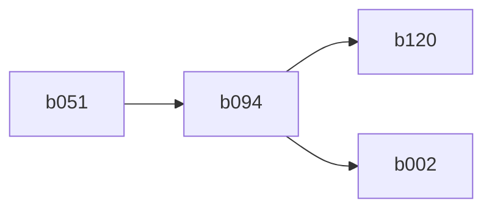

# communication test
## setup

## results
The connected PC was able to enumerate the bridge chip in b016 through the b051 connector.

# hub test
## setup

Connected b051 to a computer and b120 to a mouse.

## results
The mouse worked.
